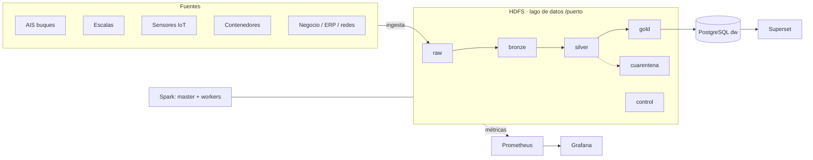

# Arquitectura de la plataforma (plantilla · fase 1)

> Completad y mantened este documento durante todo el proyecto. GitHub dibuja los diagramas `mermaid`.

## 1. Vista general

## 2. Zonas del lago de datos
| Zona | Contenido | Formato | Particionado | Quién escribe | Retención |
|---|---|---|---|---|---|
| raw | | | | | |
| bronze | | | | | |
| silver | | | | | |
| gold | | | | | |
| cuarentena | | | | | |
| control | | | | | |

## 3. Fuentes e ingesta
| Fuente | Tipo | Frecuencia real | Volumen/día | Mecanismo propuesto | Idempotente |
|---|---|---|---|---|---|

## 4. Decisiones de diseño (registro)
| Fecha | Decisión | Alternativas | Motivo |
|---|---|---|---|

## 5. Componentes y recursos
| Servicio | Función | Réplicas | Memoria |
|---|---|---|---|
